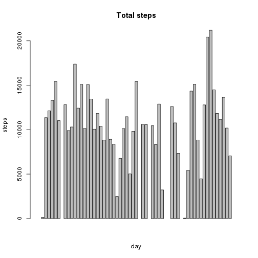
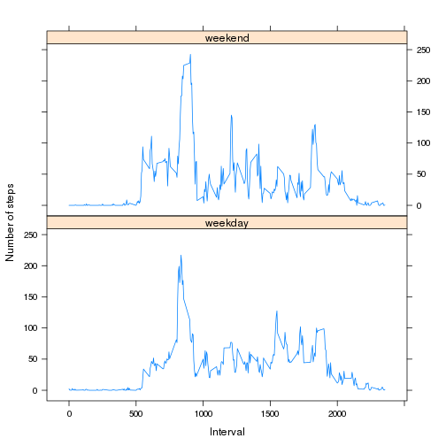

# Reproducible Research: Peer Assessment 1


## Loading and preprocessing the data

```r
require(lattice)
```

```
## Loading required package: lattice
```

```r
Sys.setlocale("LC_TIME", "C")
```

```
## [1] "C"
```

```r

df <- read.csv("activity.csv", stringsAsFactors = FALSE)
df$steps <- as.numeric(df$steps)
```


## What is mean total number of steps taken per day?
### Total steps

```r

date_grouped <- aggregate(list(total_steps = df$steps), list(date = df$date), 
    sum)

barplot(date_grouped$total_steps, names.arg = c(), xlab = "day", ylab = "steps")
```

 

### Mean

```r
date_grouped_mean <- aggregate(list(avg = df$steps), list(date = df$date), mean, 
    na.rm = TRUE)

barplot(date_grouped_mean$avg, names.arg = c(), xlab = "day", ylab = "steps mean")
```

 

### Median

```r
date_grouped_median <- aggregate(list(med = df$steps), list(date = df$date), 
    median, na.rm = TRUE)

barplot(date_grouped_median$med, names.arg = c(), xlab = "day", ylab = "steps median")
```

 


## What is the average daily activity pattern?

```r
interval_grouped <- aggregate(list(avg = df$steps), list(interval = df$interval), 
    mean, na.rm = TRUE)

plot(interval_grouped$interval, interval_grouped$avg, type = "l", xlab = "Interval", 
    ylab = "Average steps")
```

 


### maximum 5 minute interval accross all the days in the dataset

```r
interval_grouped[interval_grouped$avg == max(interval_grouped$avg), ]$interval
```

```
## [1] 835
```


## Imputing missing values
### total number of missing values in the dataset

```r
length(df$steps[is.na(df$steps)])
```

```
## [1] 2304
```


### Imputation strategy: replace NA values with interval average by all days

```r
# merge data frame with intervals grouping to get average of 5-minute period
m1 <- merge(interval_grouped, df, by.x = "interval", by.y = "interval")

# sort to get the same ordering
m1 <- m1[order(m1$date, m1$interval), ]

# replace na with average of interval
df$steps[is.na(df$steps)] <- m1$avg[is.na(df$steps)]

date_grouped1 <- aggregate(list(total_steps = df$steps), list(date = df$date), 
    sum)

barplot(date_grouped$total_steps, names.arg = c(), xlab = "day", ylab = "steps", 
    main = "Total steps")
```

 


## Are there differences in activity patterns between weekdays and

```r

# group by date and interval averaging steps
date_interval_grouped <- aggregate(list(avg = df$steps), list(interval = df$interval, 
    date = df$date), mean, na.rm = TRUE)

# get weekdays and add as column
weekday <- weekdays(as.Date(date_interval_grouped$date, "%Y-%M-%d"))
date_interval_grouped$weekday <- as.factor(weekday)

## split by weekend and weekdays

# compute averages for weekend
weekend_subset <- date_interval_grouped[date_interval_grouped$weekday %in% c("Saturday", 
    "Sunday"), ]

weekend_grouped <- aggregate(list(avg = weekend_subset$avg), list(interval = weekend_subset$interval), 
    mean, na.rm = TRUE)

weekend_grouped$weekday = as.factor("weekend")

## compute averages for weekdays

weekday_subset <- date_interval_grouped[date_interval_grouped$weekday %in% c("Monday", 
    "Tuesday", "Wednesday", "Thursday", "Friday"), ]

weekday_grouped <- aggregate(list(avg = weekday_subset$avg), list(interval = weekday_subset$interval), 
    mean, na.rm = TRUE)
weekday_grouped$weekday = as.factor("weekday")

## join and plot
total <- rbind(weekday_grouped, weekend_grouped)

xyplot(avg ~ interval | weekday, total, layout = c(1, 2), ylab = "Number of steps", 
    xlab = "Interval", type = "l")
```

 

